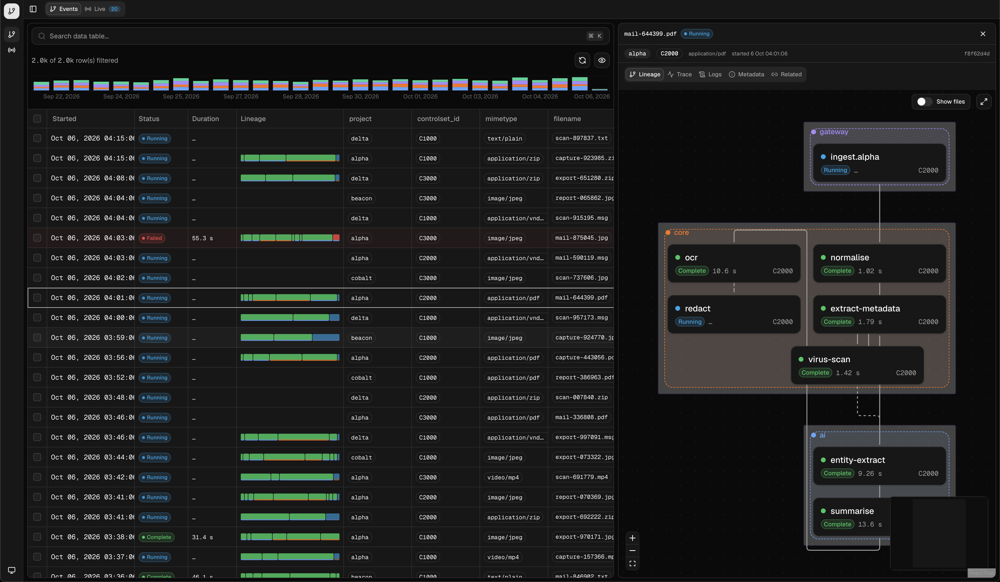
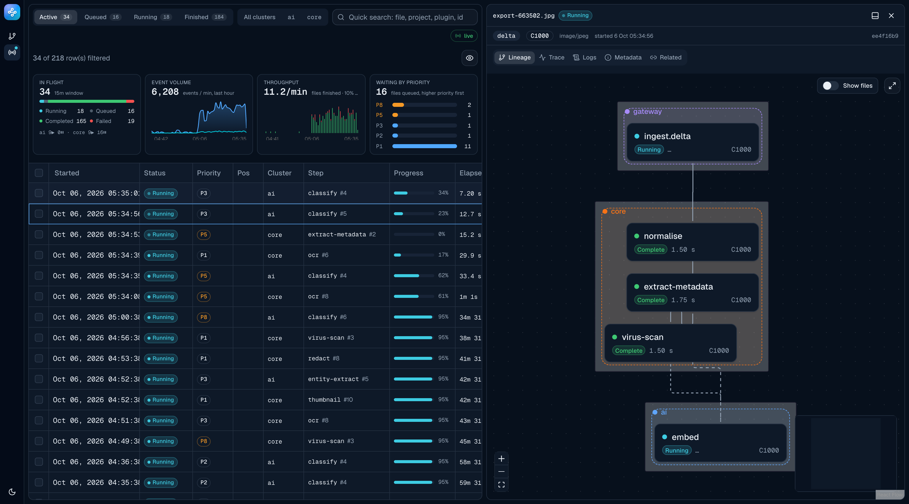

# lineage-ui

Next.js UI for processing events: a virtualised, infinite events grid with schema-driven filters, a
detail panel (dock right or bottom) with Lineage (React Flow + ELK), Trace (own Jaeger-style
waterfall), Logs, Metadata and Related tabs, and a Live tab fed over a WebSocket with charts of
in-flight work. Same stack and conventions as `query-ui`.





- `src/components/events` — grid, status pills, mini lineage strip
- `src/components/detail` — detail panel and its tabs
- `src/components/lineage` — React Flow canvas, ELK layout, node renderers
- `src/components/trace` — self-contained OTLP trace viewer (tree, virtualised rows, minimap, span detail)
- `src/components/live` — live runs grid (same table component) with status/cluster toggles, quick search and charts
- `src/lib/live` — WebSocket client and store for the live view (snapshot + deltas from `/v1/live/ws`)
- `src/lib/api` — client, TanStack Query options, types; `src/lib/schema` — mapping → grid columns and filters
- `src/components/data-table`, `src/lib/data-table|filters|store|table-schema|table` — copied from `@data-table-filters`, owned here

```sh
pnpm install
cp .env.local.example .env.local    # NEXT_PUBLIC_LINEAGE_API_URL
pnpm dev -p 3001
```

In `next dev` the [react-scan](https://github.com/aidenybai/react-scan) overlay is on, so re-renders
are visible while profiling; set `NEXT_PUBLIC_REACT_SCAN=0` to turn it off. The grid virtualises rows
(TanStack Virtual), elapsed-time cells share one clock, and live updates replace only the rows that
changed, so the tab stays smooth on modest hardware.
